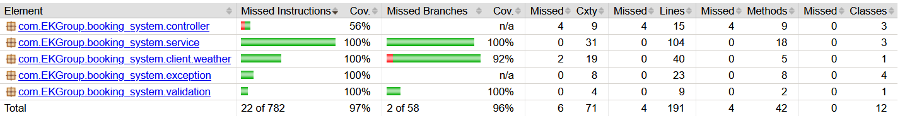

[README](../README.md)

# Jacoco Readme

## Jacoco version
The jacoco version can be found in the file `pom.xml`:
<groupId>org.jacoco</groupId>
<artifactId>jacoco-maven-plugin</artifactId>
<version>0.8.12</version>

## Run Jacococ

- Commands in the project root:
  `./mvnw verify`
- it checks if I meet a minimum coverage target of 85% of lines and 80% of branches.

- To get report, regardless of the build success:
- `./mvnw test jacoco:report`

- the results are found here:
target/site/jacoco/index.html

- to view the jacoco results, you can go to this path in a browser:
  (replace C:\Users\MYUSER\IdeaProjects\ with you actual location)
  C:\Users\MYUSER\IdeaProjects\Booking-System-Software-Quality\target\site\jacoco\index.html
- you then get a stat like this:
  

## Jacoco results explanation

Missed Instructions	Cov.:
(The smallest unit of Java bytecode)

Missed Branches	Cov.:
(Decision points in the code)

Missed	Cxty:
(Cyclomatic Complexity = a measure of how complex the code is)
In practice, there is not difference between missed Cxty and missed branches.
You can use Cxty to tell you how many more tests you need to get greate branch coverage.

Missed	Lines:
(Lines of code)

Missed	Methods:

Missed	Classes:

- If you want to change the thresholds of the build, you can edit these lines
  in the pom.xml file:
  <limits>
  <limit>
  <counter>LINE</counter>
  <value>COVEREDRATIO</value>
  <minimum>0.85</minimum>
  </limit>
  <limit>
  <counter>BRANCH</counter>
  <value>COVEREDRATIO</value>
  <minimum>0.80</minimum>
  </limit>
  </limits>

